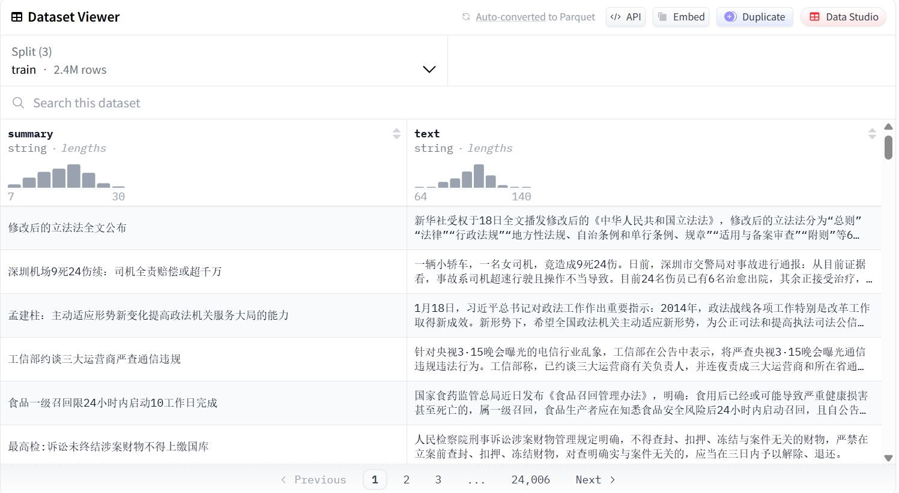
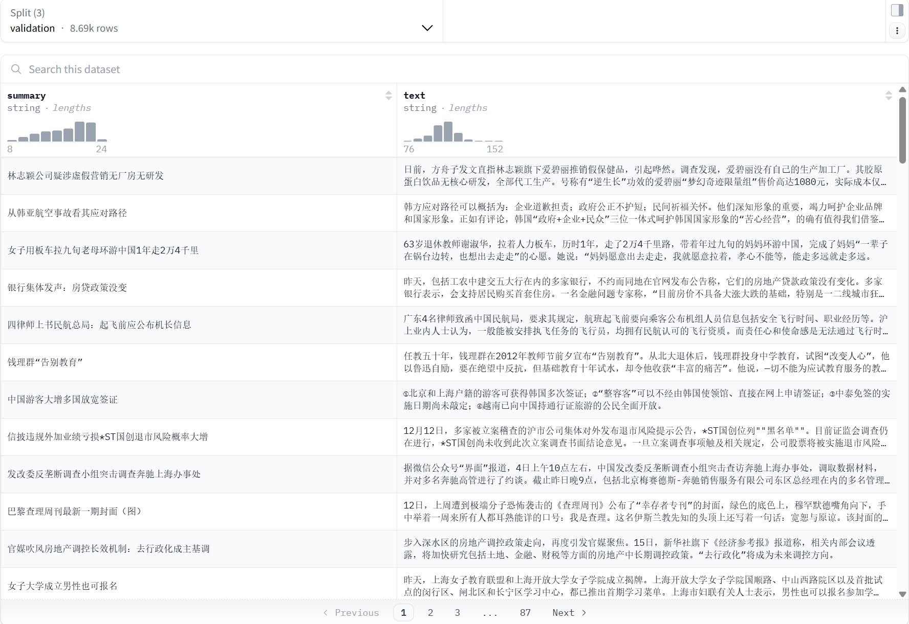
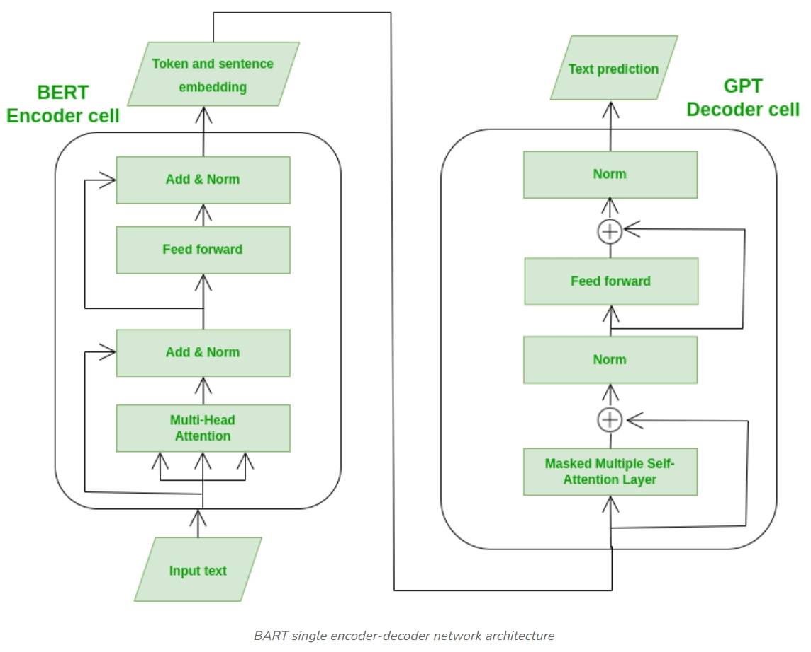

# 基于 BART 的新闻摘要智能生成系统

## 一、 项目介绍

本[项目](https://github.com/secondper/nlp-text-summaration)属于《深度学习》课程大作业，项目选择**NLP方向文章自动摘要/关键字生成**任务。利用**Transformer**架构的**BART**模型，实现了从长文本（新闻报道）到短文本（新闻标题或摘要）的自动转换。
系统基于 **[OpenMOSS-Team/bart-base-chinese](https://huggingface.co/OpenMOSS-Team/bart-base-chinese)** 预训练模型，利用 **[bert4torch](https://github.com/Tongjilibo/bert4torch)** 框架，还部署了基于**Gradio**的 Web 可视化界面，用户输入长文本即可实时获取生成的摘要，实现了从算法模型到应用落地的完整流程。

## 二、 目录结构

```text
NLP-Text-Summarization/          <-- 项目根目录
├── .gitignore                   <-- Git 忽略配置
├── README.md                    <-- 项目说明
├── requirements.txt             <-- 依赖包列表
├── web_demo.py                  <-- 基于 Gradio 的 Web 演示系统
│
├── checkpoint/                  <-- [资源] 存放OpenMOSS-Team/bart-base-chinese预训练模型 (config.json, pytorch_model.bin, vocab.txt)
│
├── data/                        <-- [资源] 数据集
│   ├── LCSTS_origin/            (下载的原始数据)
│   └── ...
│
├── model_weights/               <-- [产物] 训练好的权重
|   ├── ...
│   ├── bart_epoch_10.pt
│   └── latest_checkpoint.pt
│
├── core/                        <-- [核心] BART 模型构建，数据处理，生成器类定义
│   ├── dataset.py               (数据集处理类)
│   ├── decoder.py               (生成器类)
│   ├── model.py                 (BART 模型构建)
│
├── results/                     <-- [产物] 所有的输出结果
│   ├── results.jsonl            (训练日志)
│   ├── test_predictions.jsonl   (测试集预测结果)
│   ├── rouge_scores.txt         (测试集测试分数)
│   └── figs/                    (plot 生成的图片)
│
├── scripts/                     <-- [工具] 所有的“一次性”脚本
│   ├── download_data.py
│   ├── download_model.py
│   ├── fix_lib.py
│   ├── check_env.py
│   └── split_data.py
│
├── train/                       <-- [核心] 训练相关代码
│   └── train.py                 (主训练脚本)
│
└── utils/                       <-- [核心] 工具函数
    ├── scores_compute.py        (计算rouge分数)
    ├── evaluate.py              (evaluate函数)
    ├── plot_results.py          (绘图脚本)
    └── inference.py             (测试脚本)
```

## 三、 环境依赖

请确保安装以下环境：
- Python 3.10
- PyTorch 2.1.2 + CUDA 12.1
- bert4torch

安装命令：
`pip install -r requirements.txt`

## 四、 快速开始

1. **准备数据**：
   运行 `scripts/download_data.py` 获取数据集。原始训练集有超过240万条数据，远大于实际选择的训练集，由于原始测试集没有摘要，所以此处选择原始训练集的最后200条数据作为测试集，需要运行`scripts/split_data.py`处理数据得到测试集。
   
2. **下载模型**：
   
   -   方式一：从 Hugging Face 下载 **[OpenMOSS-Team/bart-base-chinese](https://huggingface.co/OpenMOSS-Team/bart-base-chinese)** 并放入 `checkpoint/` 目录。
   -   方式二：运行`scripts/download_model.py`可以直接下载到`checkpoint/` 目录。
   
3. **处理环境兼容问题**：请运行`scripts/fix_lib.py`修改源码中不兼容问题。

4. **可选**：`scripts/check_env.py`可以检查环境是否正常。

5. **训练**：
   可以直接执行`python train/train.py`，如果需要修改参数，可以通过命令行传入，如`python train/train.py --epochs 10 --batch_size 16 --learning_rate 3e-5`。

6. **查看训练结果**：运行`utils/plot_results.py`可以绘制`loss`和`rouge`分数变化图。

7. **测试**：

   训练结束后请修改`utils/inference.py`中的权重加载路径为你想要的路径，运行`utils/inference.py`可以得到在测试集上预测的新闻摘要，然后运行`utils/scores_compute.py`查看在测试集上的`rouge`分数。

8. **启动演示**：

   训练结束后请修改`web_demo.py`中的权重加载路径为你想要的路径，运行`web_demo.py`即可以在网页端查看效果。如果想直接查看效果，也可以下载 [模型权重](https://pan.ustc.edu.cn/share/index/deeca0c878f94d119ccf) ，放到`model_weights`文件夹下，然后运行`scripts/fix_lib.py`修改源码中不兼容问题后，就可以运行`web_demo.py`在网页端查看效果了。

## 五、 实验细节

1. 数据概况与预处理
   - 数据集介绍：选用**[LCSTS: A Large Scale Chinese Short Text Summarization Dataset](https://arxiv.org/abs/1506.05865)**数据集，由哈尔滨工业大学深圳研究生院智能计算研究中心基于新浪微博构建，包含“summarry-text”对。可以在[huggingface](https://huggingface.co/datasets/hugcyp/LCSTS)上获取。
   - 样本数量：
     - 训练集：实验3选择最多，取前100000条
     - 验证集：选取前2000条
     - 测试集：原始训练集有超过240万条数据，远大于实际选择的训练集，由于原始测试集没有摘要，所以此处选择原始训练集的最后200条数据作为测试集
   - 数据可视化：
   从**huggingface**上可以看到训练集**text**长度大多介于80-120，**summary**长度大多介于10-28，验证集**text**长度大多介于92-124，**summary**长度大多介于10-24。
   

   
   - 预处理步骤
     - 读取jsonl文件，使用`scripts/split_data.py`划分数据集
     - 分词：使用 BERT Tokenizer（bert-base-chinese 词表）进行分词。
     - 截断与填充：设定原文最大长度 maxlen=512，摘要最大长度 max_target_len=128。使用 collate_fn 动态将同批次数据 Padding 到一致长度，减少显存浪费。
2. 模型结构
   - 模型选择：**BART (Bidirectional and Auto-Regressive Transformers)**
   - 结构详解：
     - **BART**结合了**BERT**的双向编码器（Bi-directional Encoder）和**GPT**的自回归解码器（Auto-Regressive Decoder）。
     - **Encoder**：6 层 Transformer Block，12 个注意力头（Attention Heads），Hidden Size 为 768。负责理解输入文本的上下文语义。
     - **Decoder**：6 层 Transformer Block，引入 Cross-Attention 机制关注 Encoder 的输出。负责逐字生成摘要。
    
3. 训练策略与参数依据
   - **优化器**：AdamW，相比 Adam 增加了权重衰减，防止过拟合。
   - **Batch Size**：设置为32
   - **学习率调度（LR Schedule）**
     - 初始学习率：5e-5（需要根据Batch size进行调整）
     - 策略：Warmup + Linear Decay。前5%的步数进行预热，防止训练初期梯度剧烈震荡，随后线性衰减，使损失可以下降。
   - **正则化**：Dropout 设置为0.1，防止过拟合。
4. 实验环境
   - Windows 11, NVIDIA RTX 4060(8GB)
   - Python 3.10, PyTorch 2.1.2 + CUDA 12.1, bert4torch框架

## 六、 实验结果

1. 遇到的核心问题及优化方案
   - 问题一：模型参数映射
     - 描述：模型构建时，字典的键值名称不匹配
     - 解决：手动进行参数映射
   - 问题二：库函数兼容性报错
     - 描述：在使用 bert4torch 调用 BART 模型时，出现 TyprError，原因是前向传播过程中 Tensor 与 List类型不能相加。
     - 解决：分析源码之后，编写了`scripts/fix_lib.py`，解决了兼容性错误。
   - 问题三：推理阶段维度不匹配
     - 描述：在 Beam Search 生成阶段，输出的 Tensor 维度包含 Batch 维度，导致 Tokenizer 解码失败。
     - 解决：在解码前增加维度检查逻辑，确保输入 Tensor 的是一维数组
   - 问题四：学习率调度
     - 在Batch Size为32的情况下选择学习率为5e-5，采用预热+线性衰减的调度策略，不过实验结果表明，在固定学习率的情况下loss下降也比较稳定。
   - 问题五：epoch 的选择
     - 描述：epoch 太大而训练集较小时，在训练后期出现了明显的过拟合现象。
     - 解决：增大训练集或减小 epoch。
2. 对比实验设计
   - 实验1：使用较小的 Batch Size(8)+较小的训练集(5000条)+固定学习率(2e-5)，训练15个epoch
   - 实验2：使用 Batch Size(32)+较大的训练集(20000)+学习率Warmup和线性衰减，训练15个epoch
   - 实验3：使用 Batch Size(32)+更大的训练集(100000)+学习率Warmup和线性衰减，训练15个epoch
   - 实验总结：
     - 从实验结果可以看出，在固定学习率和进行预热和线性衰减调度的情况下，模型的loss下降都比较稳定。
     - 从Rouge分数来看，模型在前5~8个epoch会基本保持上升的趋势，但是训练后期Rouge分数在一定范围内波动，没有明显变化，但是此时loss仍在下降，表明出现了过拟合的现象。
     - 横向对比，主要体现了用更大的训练集进行训练，模型会取得更好的效果。
3. 核心结果展示
   - 评估指标：使用 ROUGE-1 (Unigram), ROUGE-2 (Bigram), ROUGE-L (LCS) 评价摘要质量。
   - 可视化图表：

   

   - 生成样例展示：
   
   

## 七、 总结与展望
1. 总结
   本项目基于 BART 预训练模型，成功构建了一个端到端的文本摘要系统。通过数据清洗、模型微调、参数调优，模型能够生成较好的中文摘要。项目最终通过 Gradio 实现了 Web 端部署，具有一定的实际应用价值，达到了“技术落地”的预期目标。
2. 展望与改进方向
   - 数据增强：引入更多领域（如医疗、法律）的数据，提升模型的泛化能力。
   - 部署：可以挂载到huggingface，网页端可以始终使用。

## 八、 参考说明

- BART模型介绍： [原论文](https://arxiv.org/abs/1910.13461) 以及 [一个解释](https://www.geeksforgeeks.org/artificial-intelligence/bart-model-for-text-auto-completion-in-nlp/)
- bert4torch: https://github.com/Tongjilibo/bert4torch
- Model: https://huggingface.co/OpenMOSS-Team/bart-base-chinese
