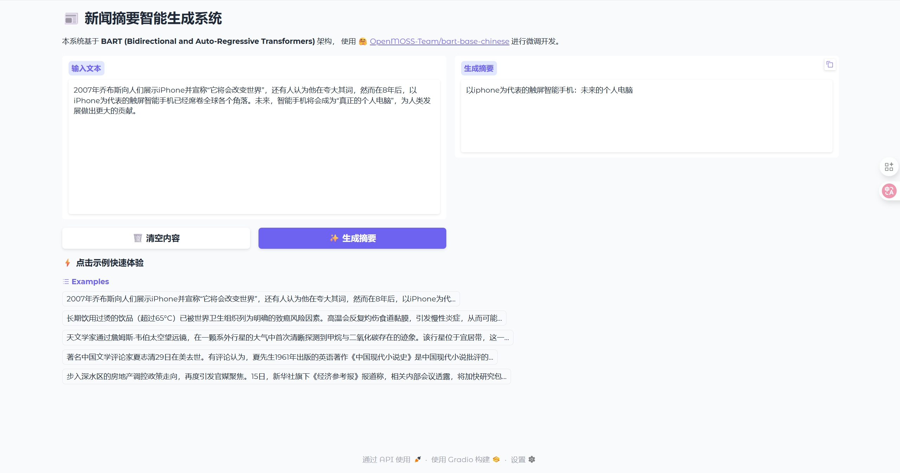
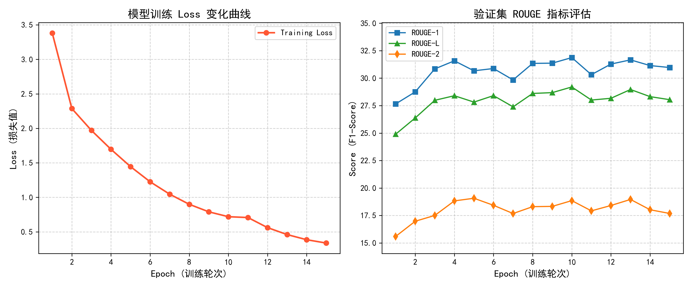

# 基于 BART 的新闻摘要智能生成系统

## 一、 项目介绍

本项目属于《深度学习》课程大作业。
基于 **[OpenMOSS-Team/bart-base-chinese](https://huggingface.co/OpenMOSS-Team/bart-base-chinese)** 预训练模型，利用 **[bert4torch](https://github.com/Tongjilibo/bert4torch)** 框架，实现了从新闻短文本到摘要或者标题的自动生成。



## 二、 目录结构

```text
NLP-Text-Summarization/          <-- 项目根目录
├── .gitignore                   <-- Git 忽略配置
├── README.md                    <-- 项目说明
├── requirements.txt             <-- 依赖包列表
├── web_demo.py                  <-- 基于 Gradio 的 Web 演示系统
│
├── checkpoint/                  <-- [资源] 存放OpenMOSS-Team/bart-base-chinese预训练模型 (config.json, pytorch_model.bin, vocab.txt)
│
├── data/                        <-- [资源] 数据集
│   ├── LCSTS_origin/            (下载的原始数据)
│   └── ...
│
├── model_weights/               <-- [产物] 训练好的权重
|   ├── ...
│   ├── bart_epoch_10.pt
│   └── latest_checkpoint.pt
│
├── core/                        <-- [核心] BART 模型构建，数据处理，生成器类定义
│   ├── dataset.py               (数据集处理类)
│   ├── decoder.py               (生成器类)
│   ├── model.py                 (BART 模型构建)
│
├── results/                     <-- [产物] 所有的输出结果
│   ├── results.jsonl            (训练日志)
│   ├── test_predictions.jsonl   (测试集预测结果)
│   ├── rouge_scores.txt         (测试集测试分数)
│   └── figs/                    (plot 生成的图片)
│
├── scripts/                     <-- [工具] 所有的“一次性”脚本
│   ├── download_data.py
│   ├── download_model.py
│   ├── fix_lib.py
│   ├── check_env.py
│   └── split_data.py
│
├── train/                       <-- [核心] 训练相关代码
│   └── train.py                 (主训练脚本)
│
└── utils/                       <-- [核心] 工具函数
    ├── scores_compute.py        (计算rouge分数)
    ├── evaluate.py              (evaluate函数)
    ├── plot_results.py          (绘图脚本)
    └── inference.py             (测试脚本)
```

## 三、 环境依赖

请确保安装以下环境：
- Python 3.10
- PyTorch 2.1.2 + CUDA 12.1
- bert4torch

安装命令：
`pip install -r requirements.txt`

## 四、 快速开始

1. **准备数据**：
   运行 `scripts/download_data.py` 获取数据集。训练集有超过240万条数据，训练只选择了前50000条，由于原始测试集没有摘要，所以此处选择训练集的最后200条数据作为测试集，需要运行`scripts/split_data.py`处理数据得到测试集。
   
2. **下载模型**：
   
   -   方式一：从 Hugging Face 下载 **[OpenMOSS-Team/bart-base-chinese](https://huggingface.co/OpenMOSS-Team/bart-base-chinese)** 并放入 `checkpoint/` 目录。
   -   方式二：运行`scripts/download_model.py`可以直接下载到`checkpoint/` 目录。
   
3. **处理环境兼容问题**：请运行`scripts/fix_lib.py`修改源码中不兼容问题。

4. **可选**：`scripts/check_env.py`可以检查环境是否正常。

5. **训练**：
   可以直接执行`python train/train.py`，如果需要修改参数，可以通过命令行传入，如`python train/train.py --epochs 10 --batch_size 16 --learning_rate 2e-5`。

6. **查看训练结果**：运行`utils/plot_results.py`可以绘制`loss`和`rouge`分数变化图。

7. **测试**：

   训练结束后请修改`utils/inference.py`中的权重加载路径为你想要的路径，运行`utils/inference.py`可以得到在测试集上预测的新闻摘要，然后运行`utils/scores_compute.py`查看在测试集上的`rouge`分数。

8. **启动演示**：

   训练结束后请修改`web_demo.py`中的权重加载路径为你想要的路径，运行`web_demo.py`即可以在网页端查看效果。如果想直接查看效果，也可以下载 [模型权重](https://pan.ustc.edu.cn/share/index/a41c7377fcb64666a3ae) ，放到`model_weights`文件夹下，然后运行`scripts/fix_lib.py`修改源码中不兼容问题后，就可以运行`web_demo.py`在网页端查看效果了。

## 五、 实验结果

从实验结果可以看到由于训练数据集较小，模型的训练在后期出现了过拟合的现象，epoch4和epoch10在指标表现上较好。



## 六、 参考说明

- BART模型介绍： [原论文](https://arxiv.org/abs/1910.13461) 以及 [一个解释](https://www.geeksforgeeks.org/artificial-intelligence/bart-model-for-text-auto-completion-in-nlp/)
- bert4torch: https://github.com/Tongjilibo/bert4torch
- Model: https://huggingface.co/OpenMOSS-Team/bart-base-chinese
